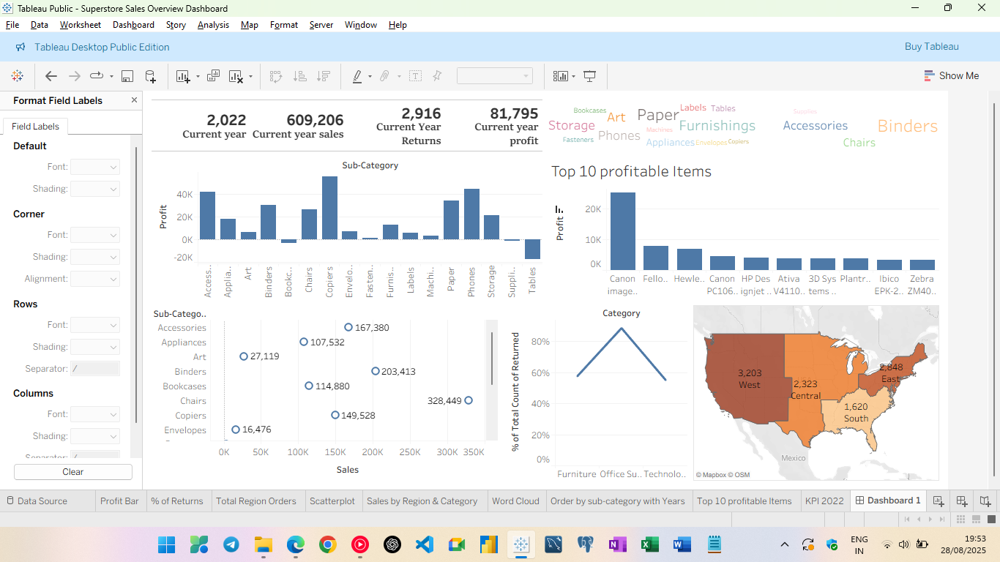

# Superstore Sales Overview Dashboard

📊 An interactive Tableau dashboard built on the **Superstore dataset**, providing insights into sales, profit, and returns across different categories, sub-categories, and regions.

---

## 📂 Project Files

* **Superstore Sales Overview Dashboard.twbx** → Tableau packaged workbook containing the dashboard.
* **Dashboard.png** → Preview image of the dashboard.

---

## 🚀 Features & Insights

* **KPI Cards**:

  * Current Year (2022) Sales: **609,206**
  * Current Year Returns: **2,916**
  * Current Year Profit: **81,795**

* **Visuals Included**:

  * 📦 **Sub-Category Performance** (Sales vs. Profit)
  * 💰 **Top 10 Profitable Items**
  * 🌎 **Regional Sales Map** (West, Central, East, South)
  * 📉 **% of Returns by Category**
  * ☁️ **Word Cloud** of Sub-Categories
  * 📊 **Scatterplot** (Sales vs. Profit with return percentage)

---

## 🛠 Tools & Technologies

* **Tableau Public / Desktop**
* Dataset: **Sample Superstore** (default Tableau dataset)

---

## 📸 Dashboard Preview

---

## 📖 How to Use

1. Clone or download this repository.
2. Open the `.twbx` file in **Tableau Public** (free) or **Tableau Desktop**.
3. Interact with filters, KPIs, and visualizations to explore insights.

---

## 🔍 Key Learnings

* Used **Calculated Fields** for KPI metrics.
* Created **Word Cloud** for sub-category visualization.
* Integrated **Maps, Scatterplots, and Bar Charts** into a single dashboard.
* Designed a **storytelling dashboard** for quick decision-making.

---

## 🤝 Contribution

Feel free to fork this repo, raise issues, or suggest improvements!

---

## 📬 Contact

👤 ** ANUPAM GUPTA **
🔗 www.linkedin.com/in/anupam-gupta-2b9a83372

---

👉 Would you like me to also **add GitHub Markdown badges** (for Tableau, dataset, license, etc.) to make it look more professional?
